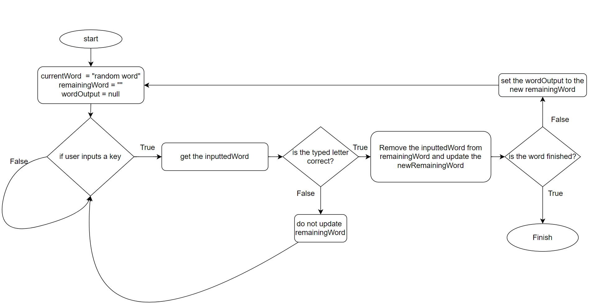

This is the initial diart of typing-game

22/09/2023
i have created the initial project by taking the first main step of the typing game. the idea i have for the typing game is that i will have one main controller where all the game actions will be happening while on another file there will be a word bank where the words are randomly given to the user. so far i have finished the main controller Typer.cs as it was said this file includes the basic functions of how the game will work.

The word that the user is asked to type is displayed on the screen (this is the wordOutput varaible), as the letters of the displayed word is typed (the typed input is the variable inputtedWord) the typed letter will be taken off from the remainingWord variable. 

this is done by checking if the typed letter is the first character in the remainingWord, if it is remove the word from remainingWord and update the wordOutput so that the remaining words are displated on the users screen, if it is not do not matching there will be no update on remainingWord. The flowchart down below shows this.

here is an example:
 after the letter H is inputted this is how it will look 