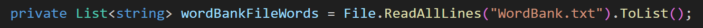
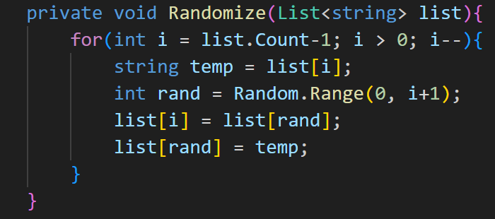
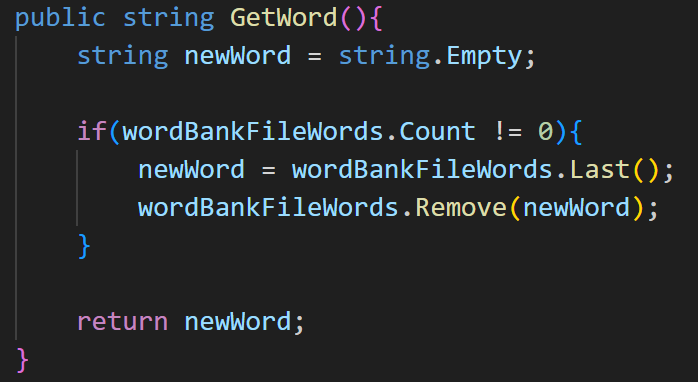

This is the initial diart of typing-game

22/09/2023
i have created the initial project by taking the first main step of the typing game. the idea i have for the typing game is that i will have one main controller where all the game actions will be happening while on another file there will be a word bank where the words are randomly given to the user. so far i have finished the main controller Typer.cs as it was said this file includes the basic functions of how the game will work.

The word that the user is asked to type is displayed on the screen, as the letters of the displayed word is typed the typed, the displayed word will update by removing the typed word, this process will repeat over till the user completes the displayed word. However if user inputs incorrect letter there will be no update on the displayed word.

The global variables are the main part for updating and displaying the word that needs to be typed. remainingWord is the variable for getting the updated word to set the Text UI variable. wordOutput is the Text UI variable to display the word in users screen. currentWord variable is used only when starting to a new word, to set up the initial word. (AT THIS MOMENT THIS WORD IS HARDCODED BUT IN THE FUTURE IT WILL BE CONNECTED TO A WORDBANK)

The method SetCurrentWord() will start the process by setting up the initial word by using the currentWord global variable as an argument of another method called SetRemainingWord().  this SetRemainingWord() method is updating the the remainingWord with the newRemainingWord that is provided by the argument, update the wordOutput global variable for display.. However as it was said above, for update action to occur the user needs to input the correct key, this is where the CheckInput() method comes in. CheckInput() gets the any inputted key and checks if it matches with the remainingWord's first character (explaing with small comments on report with arrows that Substring() is used to get the first character of the remainigWord). if the characters are matching the first letter of the remainingWord will be removed by the RemoveLetter() method and there will be another check if there are still characters in remainingWord, if there is no characters left a new word will be displayed for the user using SetCurrentWord().however if the inputted key does not match the first letter in the first place none of the explained action will happen and remainingWord will stay as it was.

the above picture shows that RemoveLetter() was used for removal of the first letter of remainingWord, this was done by using the Remove() built in method. the new version of the word remainingWordRemoved is used as an argument for SetRemainingWord(remainingWordRemoved) method to update the remainingWord.

this whole design was put all together with the help of tthis flowchart

here is an example:
 after the letter H is inputted this is how it will look 

24/09/2023
USING FISHER-YATES SHUFFLE EXPLAIN THE CODE AND TELL THE STORIES OF HOW IT WAS DONE SHOWING FROM CODE.

System.Linq was used to have methods that shortens the code.

The Bank GameObjects main purpose is to get the words from the text file into a List object. this list of objects needs to be randomized, the reason for that is so that user wont play the same words in the same order. however these words after they are randomly listed in a List, they will be taken out one by one for display on users scren.

the List where the File words will be stored is set as a global variable wordBankFileWords. To be able to Read the files i have used the System.IO namespace, this namespace has this inbuilt method called ReadAllLines("WordBank.txt") that takes in the file name as an argument, this method is basically opening the indicated file and reads it line by line and returns it in a string[] array. To put the read lines into a list i have used the in-built method called ToList() from the System.Linq namespace. This ToList() converts the string[] array into List instances.

this here is the line of code that runs this action:

After the wordBankFileWords is created it will require to be randomized to provide non-consecutive gameplay. The Fisher-Yates algorithm was used to randomize the elements of this list. The reason this algorithm is used was because there is an equal chance that each element will be in any position.(https://saturncloud.io/blog/fisheryates-shuffling-algorithm-in-c-a-comprehensive-guide/#:~:text=The%20Fisher%2DYates%20algorithm%20ensures,in%20a%20truly%20random%20permutation.)

Fisher-Yates iterates through the elements of list backwards by decrementing, starting with the last element it will randomly chose another element to swap places, and next iteration the same thing will happen but with the DECREMENTING INDEX causing this process to result in total random permutation. ASK SOMEONE IF THIS IS WRITTEN CORRECTLY.

to get the word that will be displayed the GetWord() method is used, in this method the last element of the wordBankFileWords is acquired to be returned as a string. to be used in theSetCurrentWord() method in Typer Class, where the word for display is set.
